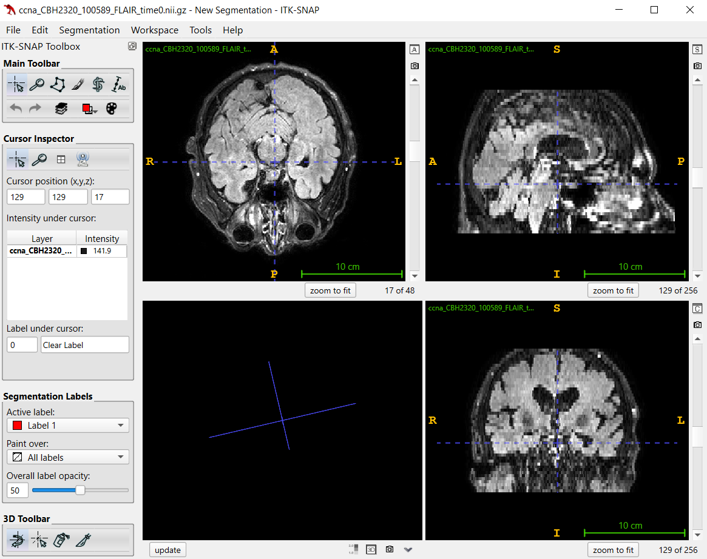
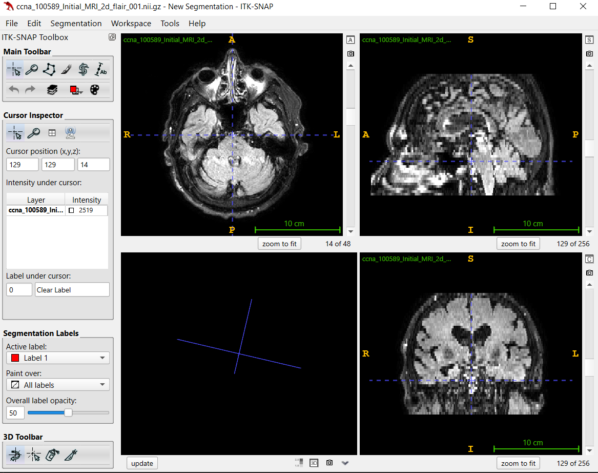

# re-orient-datasets


## CCNA

### problem

ccna_CBH2320_100589_FLAIR_time0.nii.gz(FLAIR) from _NeuroMRI_DB/CCNA/FLAIR/NIfTI/



It's clearly that A-P are flipped.


### solution

note: need docker installed.

```bash
python ccna.py
```




The orientation is correct.

